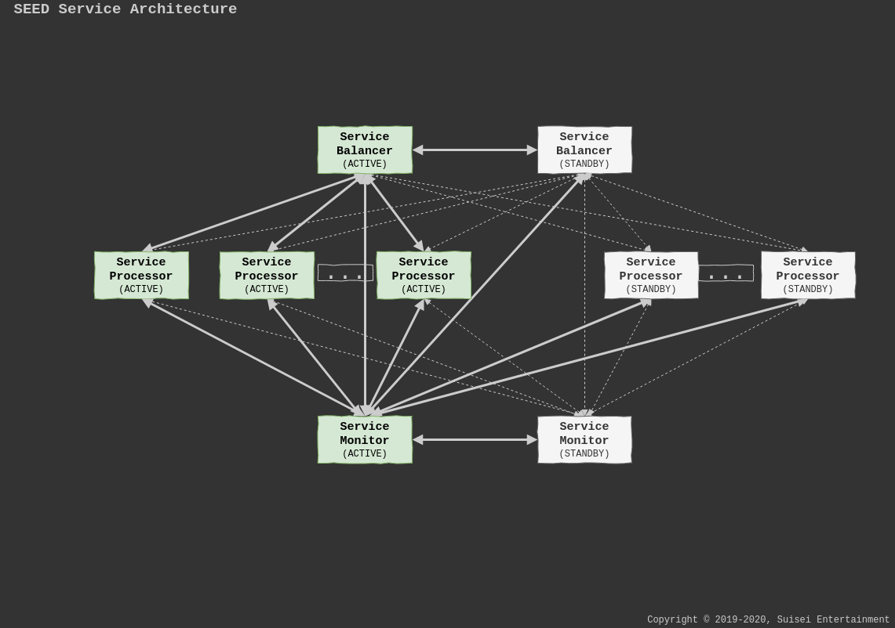

Platform Architecture
==============================

Overview
-----------------------------

Node Architecture
-----------------------------

Every SEED node is a self-managing server based on
`Docker <https://docker.com>`_ running various services that serve clients and
other services connected to the SEED network.

The main components of the SEED node are the following:

- **Base OS**: The operating system of the host the node is running on. The
  primarily used operating system at the moment is Ubuntu 18.04 LTS.
- **Docker**: Docker is used as the foundation of running the various services
  provided by the node.
- **SEED Supervisor**: The supervisor daemon is responsible for managing the
  host system and the various SEED components and services running on the node.
- **SEED Updater**: The updater daemon is responsible for checking for node
  updates and making sure that those updates are applied to the node
  automatically, potentially without any service interruption.
- **SEED Access Proxy**: The SEED proxy acts as a router and defensive firewall
  between all SEED components. It is responsible for routing SEED protocol
  messages between the various components and external entitites.
- **SEED Host Controller**: The SEED host controller is a daemon responsible to
  make changes to the host system outside Docker based on the system
  configuration applied to the supervisor daemon.

Network Architecture
-----------------------------

All SEED nodes are part of a single SEED network and provide various services
to the whole network. The network is organized into various layers based on
the functionality of services running in that layer. The following layers
exist:

- **Access Layer**: The access layer provides the entry point for all clients
  to the various network services. For a detailed documentation of the access
  layer, read the :doc:`access_layer` guide.
- **Content Layer**: The content layer is responsible for storing all
  persisted data associated with the platform, including database data, updates
  or user created content. For a detailed documentation of the content layer,
  read the :doc:`content_layer` guide.
- **Control Layer**: The control layer is responsible for the management of
  the platform. For a detailed documentation of the control layer, read the
  :doc:`control_layer` guide.
- **Realm Layer**: The realm layer is responsible for running the simulation of
  all realms. For a detailed documentation of the realm layer, read the
  :doc:`realm_layer` guide.
- **Service Layer**: The service layer is responsible for running services not
  directly associated with realms. For a detailed documentation of the service
  layer, read the :doc:`service_layer` guide.

Service Architecture
-----------------------------

Every network service can potenially be formed from services provided by
multiple nodes to ensure the necessary processing capacity is always available
for the network. Each service can contain the following functionalities:

- **Balancers**: Balancer nodes in a service provide the access point to the
  service for clients. Typically every service should have two balancers in a
  1+1 hot-standby setup to ensure availability.
- **Processors**: Processor nodes are responsible for processing requests sent
  to the service. Typically they are organized into an M+N cold standby setup.
- **Monitors**: Monitoring nodes are responsible for monitoring the operation
  of the service, making sure it's operating withing its set limits, including
  available capacity and security.

Protocol
-----------------------------

All SEED clients, services and daemons communicate with each other using the
SEED protocol, which is a protocol based on
`Google Protocol Buffers <https://developers.google.com/protocol-buffers>`_.

Data Model
----------------------------

- **Managed Object Model**: The managed object model defines both the layout of
  the SEED network, and the layout of each individual SEED node. It is an
  operational and management framework based on
  :download:`ITU-T X.700 <./documents/X.700.pdf>` specification.
- **Account Database**: The account database stores all data related to user
  accounts connecting to the network.
- **Log Database**: The log database stores all network level logs generated by
  the network.
- **Static World Database**: The static world database stores all data that is
  considered static in any state of the network. This typically means the data
  defining the rules and components of the world.
- **Dynamic World Database**: The dynamic world database contains data
  generated as a result of the user's interaction with the virtual world.
- **Telemetry Database**: The telemetry database stores various telemetry
  information collected from the network.

Logging
-----------------------------